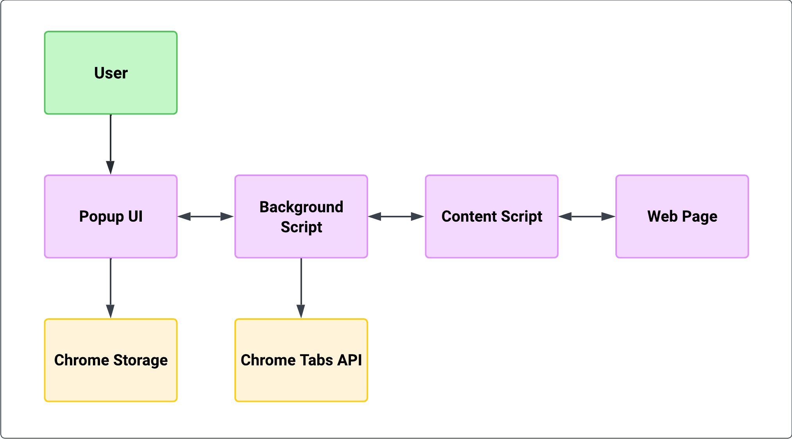

<p align="left">
  
  
  
  
  
  
  
</p>

# Accessibility Booster Extension


**Version:** 1.0.0

## Student Details
- **Full Name:** Yusuf Huseyin Arpaci
- **Student ID:** s4012930

---

## Table of Contents
- [Description](#description)
- [Features](#features)
- [Tech Stack](#tech-stack)
- [Solution Design](#solution-design)
- [Architecture Diagram](#architecture-diagram)
- [Screenshots](#screenshots)
- [Demo](#demo)
- [Installation](#installation)
- [Usage](#usage)
- [Available Scripts](#available-scripts)
- [Testing](#testing)
- [Linting](#linting)
- [Browser Compatibility](#browser-compatibility)
- [Security & Privacy](#security--privacy)
- [Troubleshooting](#troubleshooting)
- [FAQ](#faq)
- [License](#license)
- [Acknowledgements & Resources](#acknowledgements--resources)
- [Credits](#credits)
- [Contact](#contact)

---

## Description

The Accessibility Booster Chrome Extension enhances your browsing experience by adding a suite of accessibility features to any website. It aims to make the web more usable for everyone, including individuals with disabilities. The extension is lightweight and incredibly easy to use

---

## Features

This extension provides a variety of features to improve web accessibility, including:

* **High Contrast Mode:** Increases text visibility and reduces eye strain.
* **Dyslexia-Friendly Font:** Applies a font designed to be easier to read for users with dyslexia (e.g., OpenDyslexic).
* **Reading Line:** Adds a line to help focus while reading.
* **Colourblind Adjustments:** Offers filters for various types of colour blindness (Deuteranopia, Protanopia, Tritanopia).
* **Reduced Motion:** Minimizes animations and motion effects.
* **Keyboard Navigation Enhancements:** Improves focus indicators and tab navigation.
* **Large Click Targets:** Increases the size of interactive elements.
* **Custom Cursor:** Provides alternative cursor styles for better visibility along with greater size.
* **Auto Scroll:** Enables automatic page scrolling with zones at the top and bottom.
* **Hover Controls:** Provides controls that appear on hover for easier interaction.
* **Focus Mode:** Dims the surrounding page content to highlight the active reading area similar to the reading line.
* **Highlight Links:** Makes all links on a page highlighted.
* **Reading Progress Bar:** Shows a visual indicator at the top for how far you've scrolled through a page.
* **Image Descriptions (Alt Text Viewer):** Helps users see alternative text for images when hovering over them.

---

## Tech Stack

* TypeScript
* React (for the popup UI)
* Vite (for building and development server)
* Vitest (for testing)
* ESLint (for code linting)
* CSS (for styling accessibility features)
* Chrome Extensions API

---

## Solution Design

The extension is designed to be modular and scalable, with each accessibility feature implemented as a separate module. The popup UI is built with React for a modern, responsive experience. State is managed globally and persisted using Chrome's storage API, ensuring settings are applied across all tabs and sessions.

- **State Management:** All feature toggles and settings are stored in a global state object and persisted using Chrome's `storage.sync` API.
- **Performance:** Debounced storage writes and efficient tab messaging ensure minimal performance impact.
- **Accessibility First:** All UI components are designed with accessibility in mind, including ARIA labels and keyboard navigation.

---

## Architecture Diagram



---

## Screenshots

-   

---

## Demo


<p align="center"><i>Replace with a GIF showing the extension in action.</i></p>

---

## Installation

1. **Download or Clone the Repository:**
    
    Go to Command Prompt, VSCode or a terminal of your choice.

    ```bash
    git clone <https://github.com/s4012930/accessible-extension>
    cd accessible-extension
    ```
    
    <i>Replace with a screenshot of cloning the repo in your terminal.</i>

2. **Build the Extension:**
    ```bash
    npm install
    npm run build
    ```
    
    <i>Replace with a screenshot of running npm install/build.</i>

3. **Load the Extension in Chrome:**
    * Open Chrome and navigate to `chrome://extensions`.
      
    * Enable "Developer mode" using the toggle switch in the top right corner.
      
    * Click on the "Load unpacked" button.
      
    * Select the [dist](http://_vscodecontentref_/0) folder.
      
    * See enabled Accessibility Booster 1.0.0 inside of extensions.
      

---

## Usage

1. Click on the Accessibility Booster icon in the Chrome toolbar to open the popup.
2. Toggle the desired accessibility features on or off using the switches and controls provided in the popup interface.
3. Settings are saved and applied automatically to all current and future tabs.
4. Use the keyboard shortcut `Ctrl+Shift+F` (or `Command+Shift+F` on Mac) to quickly open the extension popup without clicking.

---

## Available Scripts

In the project directory, you can run the following scripts:

* `npm run dev`: Starts the development server using Vite.
* `npm run build`: Builds the extension for production (compiles TypeScript, Vite build, and copies CSS).
* `npm run lint`: Lints the codebase using ESLint.
* `npm run preview`: Serves the production build locally for preview.
* `npm run test`: Runs tests once using Vitest.
* `npm run test:watch`: Runs tests in watch mode.
* `npm run test:ui`: Opens the Vitest UI for an interactive testing experience.
* `npm run test:html`: Runs tests and generates an HTML report (`test-results.html`), then attempts to open it.

---

## Testing

To run the automated tests for this extension:

* For a single run:
    ```bash
    npm run test
    ```
* To run tests and view results in an HTML report:
    ```bash
    npm run test:html
    ```
    This will generate `test-results.html` in the root directory.
* For an interactive UI:
    ```bash
    npm run test:ui
    ```

* My Recommendation:
    ```bash
    npm run test:ui
    ```

---

## Linting

To check code quality and style, run:

```bash
npm run lint
```
If all checks pass, you'll see:
```
 ESLint: All files passed linting checks!
```

---

## Browser Compatibility

- Chrome (latest)
- Edge (latest)
- Opera (latest)
- Brave (latest)

---

## Security & Privacy

This extension does **NOT** collect or transmit any personal data. All settings are stored locally using Chrome’s secure storage API.

---

## Troubleshooting

- **Extension not appearing?**  
  Make sure you selected the correct [dist](http://_vscodecontentref_/1) folder and that your manifest is valid.
- **Feature not working on a site?**  
  Some sites restrict content scripts. Try refreshing the page or checking permissions.

---

## FAQ

**Q: Does this extension work on all websites?**  
A: Most features work on the majority of websites, but some highly dynamic or protected sites may limit functionality.

**Q: How do I reset all settings to default?**  
A: Open the popup and click the "Turn All Off" button at the bottom.

---

## License

This project is licensed under the MIT License - see the [LICENSE](./LICENSE) file for details.

---

## Acknowledgements & Resources

- [Chrome Extensions Documentation](https://developer.chrome.com/docs/extensions/)
- [WebAIM: Web Accessibility In Mind](https://webaim.org/)
- [Chrome for Developers: Accessibility](https://developer.chrome.com/docs/accessibility)
- [Shields.io for Badges](https://shields.io/)

---

## Contact

For questions or support, please contact me: s4012930@student.rmit.edu.au

---

## Credits

- Icons by [Lucide](https://lucide.dev/)
- Fonts by [OpenDyslexic](https://opendyslexic.org/)
